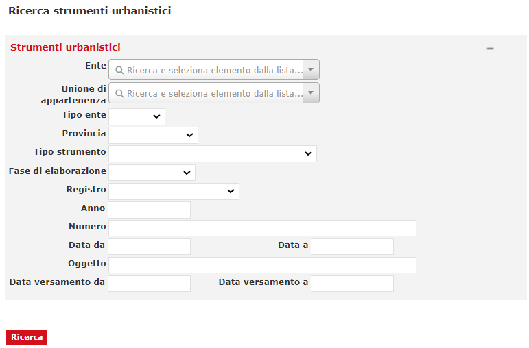

# DIPS

Fonte template redazione documento:  https://www.makeareadme.com/.


# Descrizione

DIPS (DIPSpenser) è il modulo del sistema di conservazione SACER che consente di configurare tramite opportuna parametrazione delle interfacce di ricerca e presentazione di documenti e aggregazioni documentali presesenti su Sacer da utilizzarsi quando le funzionalità di ricerca messe a disposizione dall’interfaccia web di SacER non riescono a soddisfare le particolari esigenze dell’Utente 

Il modulo, previo controllo dei diritti di accesso alle informazioni, consente di attivare ricerche complesse sul Sistema sulla base delle Informazioni descrittive memorizzate dalle funzionalità di Gestione dati di Sacer e di ottenere l’esibizione dei documenti individuati dalla ricerca richiedendo gli AIP alle funzionalità di Archiviazione, sfruttando le funzionalità di Accesso di SacER.  


# Installazione

Requisiti minimi per installazione: 

- Sistema operativo : consigliato Linux server (in alternativa compatibilità con Windows server);
- Java versione 11 (OpenJDK / Oracle);
- JBoss 7 EAP;
- Oracle DB (versione consigliata 19c).

## Instalazione JDK 

Consigliata adozione della OpenJDK alla versione 8, guida all'installazione https://openjdk.org/install/.

## Setup application server (Jboss 7)

Richiesta l'esecuzione delle seguenti guide secondo l'ordine riportato di seguito: 

1. guida per la configurazione **base** di [guida 1](src/docs/JBoss7_configurazione_generale.md);
2. guida con le configurazioni **specifiche** per il contesto applicativo **DIPS**  di [guida 2](src/docs/JBoss7_configurazione_dips.md).

### Deploy su JBoss 7

Di seguito le indicazioni per il rilascio su application server JBoss7: 

1. generazione dell'artifact attraverso tool maven, eseguire il seguente comando: 

   ```bash
   mvn package
   ```
   
2. viene generato l'artifact .ear all'interno del modulo dispenser-ear/target (e.g. sacerdips-1.0.0.ear)
3. deploy dell'ear generato allo step 1 su JBoss 7 (vedi configurazione [setup JBoss7](#setup-application-server-jboss-7))


## Predisposizione database

L'applicazione utilizza come DBMS di riferimento Oracle DB (https://www.oracle.com/it/database/) alla versione, consigliata, **19c**. Per l'installazione e la configurazione fare riferimento alle guide ufficiali.

Per la creazione del modello E-R consultare il seguente [README.md](https://github.com/RegioneER/parer-db-init/blob/master/README.md) (progetto di riferimento https://github.com/RegioneER/parer-db-init).


# Utilizzo

A seconda del modello di SIP utilizzato e delle sue caratteristiche, il SIP potrebbe essere composto solo dall’Indice SIP.

I SIP versati sono sottoposti a varie verifiche per essere accettati e presi in carico:
- Verifiche formali
- Verifiche semantiche
- Verifiche sul formato dei file versati
- Verifiche sulle firme digitali

I servizi esposti sono i seguenti:

- Versamento Unità documentarie (VersamentoSync): consente di versare in SACER un pacchetto di versamento contenente un’Unità documentaria;
- Aggiunta Documento (AggiuntaAllegatiSync): consente di versare in SACER un pacchetto di versamento contenente un Documento da aggiungere a un’Unità documentaria già presente nel sistema;
- Aggiornamento metadati Unità documentaria (AggiornamentoVersamentoSync): consente di versare in SACER un pacchetto di versamento contenente i metadati per aggiornare quelli di un’unità documentaria già presente nel sistema;
- Versamento Unità documentarie Multimedia (VersamentoMultiMedia): è una variante del servizio Versamento Unità documentarie in cui gli oggetti-dati (file) non sono trasmessi nella chiamata REST ma preventivamente collocati su un’area di lavoro e referenziati nell’Indice SIP;
- Versamento fascicolo (VersamentoFascicoloSync): consente di versare in SACER un pacchetto di versamento contenente un fascicolo.

Tutti i dettagli sulla composizione dei SIP, le modalità di invocazione dei servizi e le verifiche effettuate al versamento sono nei documenti di specifiche tecniche pubblicate a questo indirizzo: Documentazione — ParER — Polo archivistico dell'Emilia-Romagna (regione.emilia-romagna.it)


# Ricerche 

Il sistema offre delle pagine di ricerca specializzate per ambito. 

 

Esempio di pagina ricerca degli Strumenti Urbanistici. 
 
 

Esempio di pagina ricerca dei Progetti di ricostruzione. 

 

  
# Librerie utilizzate

|  GroupId | ArtifactId  | Version |
|:---:|:---:|:---:|
|antlr|antlr|2.7.7.redhat-7|
|com.fasterxml.jackson.core|jackson-annotations|2.12.7.redhat-00003|
|com.fasterxml.jackson.core|jackson-core|2.12.7.redhat-00003|
|com.fasterxml.jackson.core|jackson-databind|2.12.7.redhat-00003|
|com.fasterxml.woodstox|woodstox-core|6.4.0.redhat-00001|
|com.fasterxml|classmate|1.5.1.redhat-00001|
|com.io7m.xom|xom|1.2.10|
|com.narupley|not-going-to-be-commons-ssl|0.3.20|
|com.sun.activation|jakarta.activation|1.2.2.redhat-00002|
|com.sun.istack|istack-commons-runtime|3.0.10.redhat-00001|
|com.sun.mail|jakarta.mail|1.6.7.redhat-00003|
|com.zaxxer|SparseBitSet|1.3|
|commons-beanutils|commons-beanutils|1.9.4|
|commons-codec|commons-codec|1.15.0.redhat-00001|
|commons-fileupload|commons-fileupload|1.5|
|commons-io|commons-io|2.16.1|
|commons-logging|commons-logging|1.3.3|
|commons-net|commons-net|3.9.0|
|it.eng.parer|spagofat-core|6.15.0|
|it.eng.parer|spagofat-middle|6.15.0|
|it.eng.parer|spagofat-paginator-ejb|6.15.0|
|it.eng.parer|spagofat-paginator-gf|6.15.0|
|it.eng.parer|spagofat-timer-wrapper-common|6.15.0|
|jakarta.activation|jakarta.activation-api|2.1.2|
|jakarta.enterprise|jakarta.enterprise.cdi-api|2.0.2.redhat-00002|
|jakarta.inject|jakarta.inject-api|1.0.3.redhat-00001|
|jakarta.json.bind|jakarta.json.bind-api|1.0.2.redhat-00001|
|jakarta.json|jakarta.json-api|1.1.6.redhat-00001|
|jakarta.persistence|jakarta.persistence-api|2.2.3.redhat-00001|
|jakarta.security.enterprise|jakarta.security.enterprise-api|1.0.2.redhat-00001|
|jakarta.validation|jakarta.validation-api|2.0.2.redhat-00001|
|jakarta.xml.bind|jakarta.xml.bind-api|2.3.2|
|javax.annotation|javax.annotation-api|1.3.2|
|javax.jws|jsr181-api|1.0.0.MR1-redhat-8|
|javax.xml.bind|jaxb-api|2.3.0|
|javax.xml.soap|javax.xml.soap-api|1.4.0|
|javax.xml.ws|jaxws-api|2.3.1|
|joda-time|joda-time|2.12.5|
|net.bytebuddy|byte-buddy|1.11.12.redhat-00002|
|org.apache-extras.beanshell|bsh|2.0b6|
|org.apache.commons|commons-collections4|4.5.0-M2|
|org.apache.commons|commons-lang3|3.15.0|
|org.apache.commons|commons-math3|3.6.1|
|org.apache.commons|commons-text|1.12.0|
|org.apache.httpcomponents|httpclient|4.5.14|
|org.apache.httpcomponents|httpcore|4.4.16|
|org.apache.logging.log4j|log4j-api|2.23.1|
|org.apache.poi|poi|5.3.0|
|org.apache.santuario|xmlsec|2.3.4.redhat-00002|
|org.apache.taglibs|taglibs-standard-impl|1.2.6.RC1-redhat-1|
|org.apache.taglibs|taglibs-standard-spec|1.2.6.RC1-redhat-1|
|org.apache.velocity|velocity-engine-core|2.3|
|org.apache.xmlbeans|xmlbeans|5.1.1|
|org.bouncycastle|bcpkix-jdk18on|1.77|
|org.bouncycastle|bcprov-jdk18on|1.77|
|org.bouncycastle|bcutil-jdk18on|1.77|
|org.codehaus.jettison|jettison|1.5.4.redhat-00002|
|org.codehaus.woodstox|stax2-api|4.2.1.redhat-00001|
|org.dom4j|dom4j|2.1.3.redhat-00001|
|org.eclipse.microprofile.openapi|microprofile-openapi-api|3.1.1|
|org.glassfish.jaxb|jaxb-runtime|2.3.3.b02-redhat-00002|
|org.glassfish.jaxb|txw2|2.3.3.b02-redhat-00002|
|org.hibernate.common|hibernate-commons-annotations|5.0.5.Final-redhat-00002|
|org.hibernate.validator|hibernate-validator|6.0.23.Final-redhat-00001|
|org.hibernate|hibernate-core|5.3.36.Final-redhat-00001|
|org.javassist|javassist|3.27.0.GA-redhat-00001|
|org.jboss.logging|jboss-logging|3.4.1.Final-redhat-00001|
|org.jboss.spec.javax.annotation|jboss-annotations-api_1.3_spec|2.0.1.Final-redhat-00001|
|org.jboss.spec.javax.batch|jboss-batch-api_1.0_spec|2.0.0.Final-redhat-00001|
|org.jboss.spec.javax.ejb|jboss-ejb-api_3.2_spec|2.0.0.Final-redhat-00001|
|org.jboss.spec.javax.el|jboss-el-api_3.0_spec|2.0.1.Final-redhat-00001|
|org.jboss.spec.javax.enterprise.concurrent|jboss-concurrency-api_1.0_spec|2.0.0.Final-redhat-00001|
|org.jboss.spec.javax.faces|jboss-jsf-api_2.3_spec|3.0.0.SP08-redhat-00001|
|org.jboss.spec.javax.interceptor|jboss-interceptors-api_1.2_spec|2.0.0.Final-redhat-00002|
|org.jboss.spec.javax.jms|jboss-jms-api_2.0_spec|2.0.0.Final-redhat-00001|
|org.jboss.spec.javax.management.j2ee|jboss-j2eemgmt-api_1.1_spec|2.0.0.Final-redhat-00001|
|org.jboss.spec.javax.resource|jboss-connector-api_1.7_spec|2.0.0.Final-redhat-00001|
|org.jboss.spec.javax.security.auth.message|jboss-jaspi-api_1.1_spec|2.0.1.Final-redhat-00001|
|org.jboss.spec.javax.security.jacc|jboss-jacc-api_1.5_spec|2.0.0.Final-redhat-00001|
|org.jboss.spec.javax.servlet.jsp|jboss-jsp-api_2.3_spec|2.0.1.Final-redhat-00001|
|org.jboss.spec.javax.servlet|jboss-servlet-api_4.0_spec|2.0.0.Final-redhat-00001|
|org.jboss.spec.javax.transaction|jboss-transaction-api_1.3_spec|2.0.0.Final-redhat-00005|
|org.jboss.spec.javax.websocket|jboss-websocket-api_1.1_spec|2.0.0.Final-redhat-00001|
|org.jboss.spec.javax.ws.rs|jboss-jaxrs-api_2.1_spec|2.0.1.Final-redhat-00001|
|org.jboss.spec.javax.xml.bind|jboss-jaxb-api_2.3_spec|2.0.1.Final-redhat-00001|
|org.jboss.spec.javax.xml.soap|jboss-saaj-api_1.4_spec|1.0.2.Final-redhat-00002|
|org.jboss.spec.javax.xml.ws|jboss-jaxws-api_2.3_spec|2.0.0.Final-redhat-00001|
|org.jboss.spec|jboss-jakartaee-8.0|1.0.1.Final-redhat-00008|
|org.jboss|jandex|2.4.4.Final-redhat-00001|
|org.jboss|jboss-vfs|3.1.0.Final|
|org.keycloak|keycloak-adapter-core|24.0.5|
|org.keycloak|keycloak-adapter-spi|24.0.5|
|org.keycloak|keycloak-authz-client|24.0.5|
|org.keycloak|keycloak-common|24.0.5|
|org.keycloak|keycloak-core|24.0.5|
|org.keycloak|keycloak-crypto-default|24.0.5|
|org.keycloak|keycloak-policy-enforcer|24.0.5|
|org.keycloak|keycloak-server-spi-private|24.0.5|
|org.keycloak|keycloak-server-spi|24.0.5|
|org.keycloak|keycloak-servlet-adapter-spi|24.0.5|
|org.keycloak|keycloak-servlet-filter-adapter|24.0.5|
|org.opensaml|opensaml|2.6.6|
|org.opensaml|openws|1.5.6|
|org.opensaml|xmltooling|1.4.6|
|org.owasp.esapi|esapi|2.2.0.0|
|org.slf4j|slf4j-api|1.7.22.redhat-2|
|org.springframework.security.extensions|spring-security-saml2-core|1.0.10.RELEASE|
|org.springframework.security|spring-security-config|5.8.13|
|org.springframework.security|spring-security-core|5.8.13|
|org.springframework.security|spring-security-crypto|5.8.13|
|org.springframework.security|spring-security-web|5.8.13|
|org.springframework|spring-aop|5.3.39|
|org.springframework|spring-beans|5.3.39|
|org.springframework|spring-context|5.3.39|
|org.springframework|spring-core|5.3.39|
|org.springframework|spring-expression|5.3.39|
|org.springframework|spring-jcl|5.3.39|
|org.springframework|spring-web|5.3.39|
|org.springframework|spring-webmvc|5.3.39|
|xml-apis|xml-apis|1.4.01|
|com.fasterxml.jackson.core|jackson-annotations|2.12.7.redhat-00003|
|com.fasterxml.jackson.core|jackson-core|2.12.7.redhat-00003|
|com.fasterxml.jackson.core|jackson-databind|2.12.7.redhat-00003|
|com.fasterxml.woodstox|woodstox-core|6.4.0.redhat-00001|
|com.io7m.xom|xom|1.2.10|
|com.narupley|not-going-to-be-commons-ssl|0.3.20|
|com.sun.activation|jakarta.activation|1.2.2.redhat-00002|
|com.sun.mail|jakarta.mail|1.6.7.redhat-00003|
|com.zaxxer|SparseBitSet|1.3|
|commons-beanutils|commons-beanutils|1.9.4|
|commons-codec|commons-codec|1.15.0.redhat-00001|
|commons-fileupload|commons-fileupload|1.5|
|commons-io|commons-io|2.16.1|
|commons-logging|commons-logging|1.3.3|
|commons-net|commons-net|3.9.0|
|it.eng.parer|sacerdips-jboss-jpa|5.1.1-SNAPSHOT|
|it.eng.parer|spagofat-core|6.15.0|
|it.eng.parer|spagofat-middle|6.15.0|
|jakarta.activation|jakarta.activation-api|2.1.2|
|jakarta.enterprise|jakarta.enterprise.cdi-api|2.0.2.redhat-00002|
|jakarta.inject|jakarta.inject-api|1.0.3.redhat-00001|
|jakarta.json.bind|jakarta.json.bind-api|1.0.2.redhat-00001|
|jakarta.json|jakarta.json-api|1.1.6.redhat-00001|
|jakarta.persistence|jakarta.persistence-api|2.2.3.redhat-00001|
|jakarta.security.enterprise|jakarta.security.enterprise-api|1.0.2.redhat-00001|
|jakarta.validation|jakarta.validation-api|2.0.2.redhat-00001|
|javax.annotation|javax.annotation-api|1.3.2|
|javax.jws|jsr181-api|1.0.0.MR1-redhat-8|
|javax.xml.bind|jaxb-api|2.3.0|
|javax.xml.soap|javax.xml.soap-api|1.4.0|
|javax.xml.ws|jaxws-api|2.3.1|
|joda-time|joda-time|2.12.5|
|org.apache-extras.beanshell|bsh|2.0b6|
|org.apache.commons|commons-collections4|4.5.0-M2|
|org.apache.commons|commons-lang3|3.15.0|
|org.apache.commons|commons-math3|3.6.1|
|org.apache.commons|commons-text|1.12.0|
|org.apache.httpcomponents|httpclient|4.5.14|
|org.apache.httpcomponents|httpcore|4.4.16|
|org.apache.logging.log4j|log4j-api|2.18.0|
|org.apache.logging.log4j|log4j-core|2.18.0|
|org.apache.poi|poi|5.3.0|
|org.apache.santuario|xmlsec|2.3.4.redhat-00002|
|org.apache.taglibs|taglibs-standard-impl|1.2.6.RC1-redhat-1|
|org.apache.taglibs|taglibs-standard-spec|1.2.6.RC1-redhat-1|
|org.apache.velocity|velocity-engine-core|2.3|
|org.apache.xmlbeans|xmlbeans|5.1.1|
|org.bouncycastle|bcpkix-jdk18on|1.77|
|org.bouncycastle|bcprov-jdk18on|1.77|
|org.bouncycastle|bcutil-jdk18on|1.77|
|org.codehaus.jettison|jettison|1.5.4.redhat-00002|
|org.codehaus.woodstox|stax2-api|4.2.1.redhat-00001|
|org.dom4j|dom4j|2.1.3.redhat-00001|
|org.eclipse.microprofile.openapi|microprofile-openapi-api|3.1.1|
|org.jboss.logging|jboss-logging|3.4.1.Final-redhat-00001|
|org.jboss.spec.javax.annotation|jboss-annotations-api_1.3_spec|2.0.1.Final-redhat-00001|
|org.jboss.spec.javax.batch|jboss-batch-api_1.0_spec|2.0.0.Final-redhat-00001|
|org.jboss.spec.javax.ejb|jboss-ejb-api_3.2_spec|2.0.0.Final-redhat-00001|
|org.jboss.spec.javax.el|jboss-el-api_3.0_spec|2.0.1.Final-redhat-00001|
|org.jboss.spec.javax.enterprise.concurrent|jboss-concurrency-api_1.0_spec|2.0.0.Final-redhat-00001|
|org.jboss.spec.javax.faces|jboss-jsf-api_2.3_spec|3.0.0.SP08-redhat-00001|
|org.jboss.spec.javax.interceptor|jboss-interceptors-api_1.2_spec|2.0.0.Final-redhat-00002|
|org.jboss.spec.javax.jms|jboss-jms-api_2.0_spec|2.0.0.Final-redhat-00001|
|org.jboss.spec.javax.management.j2ee|jboss-j2eemgmt-api_1.1_spec|2.0.0.Final-redhat-00001|
|org.jboss.spec.javax.resource|jboss-connector-api_1.7_spec|2.0.0.Final-redhat-00001|
|org.jboss.spec.javax.security.auth.message|jboss-jaspi-api_1.1_spec|2.0.1.Final-redhat-00001|
|org.jboss.spec.javax.security.jacc|jboss-jacc-api_1.5_spec|2.0.0.Final-redhat-00001|
|org.jboss.spec.javax.servlet.jsp|jboss-jsp-api_2.3_spec|2.0.1.Final-redhat-00001|
|org.jboss.spec.javax.servlet|jboss-servlet-api_4.0_spec|2.0.0.Final-redhat-00001|
|org.jboss.spec.javax.transaction|jboss-transaction-api_1.3_spec|2.0.0.Final-redhat-00005|
|org.jboss.spec.javax.websocket|jboss-websocket-api_1.1_spec|2.0.0.Final-redhat-00001|
|org.jboss.spec.javax.ws.rs|jboss-jaxrs-api_2.1_spec|2.0.1.Final-redhat-00001|
|org.jboss.spec.javax.xml.bind|jboss-jaxb-api_2.3_spec|2.0.1.Final-redhat-00001|
|org.jboss.spec.javax.xml.soap|jboss-saaj-api_1.4_spec|1.0.2.Final-redhat-00002|
|org.jboss.spec.javax.xml.ws|jboss-jaxws-api_2.3_spec|2.0.0.Final-redhat-00001|
|org.jboss.spec|jboss-jakartaee-8.0|1.0.1.Final-redhat-00008|
|org.keycloak|keycloak-adapter-core|24.0.5|
|org.keycloak|keycloak-adapter-spi|24.0.5|
|org.keycloak|keycloak-authz-client|24.0.5|
|org.keycloak|keycloak-common|24.0.5|
|org.keycloak|keycloak-core|24.0.5|
|org.keycloak|keycloak-crypto-default|24.0.5|
|org.keycloak|keycloak-policy-enforcer|24.0.5|
|org.keycloak|keycloak-server-spi-private|24.0.5|
|org.keycloak|keycloak-server-spi|24.0.5|
|org.keycloak|keycloak-servlet-adapter-spi|24.0.5|
|org.keycloak|keycloak-servlet-filter-adapter|24.0.5|
|org.opensaml|opensaml|2.6.6|
|org.opensaml|openws|1.5.6|
|org.opensaml|xmltooling|1.4.6|
|org.owasp.esapi|esapi|2.2.0.0|
|org.slf4j|slf4j-api|1.7.22.redhat-2|
|org.springframework.security.extensions|spring-security-saml2-core|1.0.10.RELEASE|
|org.springframework.security|spring-security-config|5.8.13|
|org.springframework.security|spring-security-core|5.8.13|
|org.springframework.security|spring-security-crypto|5.8.13|
|org.springframework.security|spring-security-web|5.8.13|
|org.springframework|spring-aop|5.3.39|
|org.springframework|spring-beans|5.3.37|
|org.springframework|spring-context|5.3.39|
|org.springframework|spring-core|5.3.39|
|org.springframework|spring-expression|5.3.39|
|org.springframework|spring-jcl|5.3.39|
|org.springframework|spring-web|5.3.39|
|org.springframework|spring-webmvc|5.3.39|
|xml-apis|xml-apis|1.4.01|
|org.slf4j|slf4j-api|1.7.22.redhat-2|
|org.springframework|spring-aop|5.3.39|
|org.springframework|spring-beans|5.3.39|
|org.springframework|spring-context-support|5.3.39|
|org.springframework|spring-context|5.3.39|
|org.springframework|spring-core|5.3.39|
|org.springframework|spring-expression|5.3.39|
|org.springframework|spring-jcl|5.3.39|
|org.springframework|spring-jdbc|5.3.39|
|org.springframework|spring-tx|5.3.39|
|com.fasterxml.jackson.core|jackson-annotations|2.12.7.redhat-00003|
|com.fasterxml.jackson.core|jackson-core|2.12.7.redhat-00003|
|com.fasterxml.jackson.core|jackson-databind|2.12.7.redhat-00003|
|com.fasterxml.woodstox|woodstox-core|6.4.0.redhat-00001|
|com.io7m.xom|xom|1.2.10|
|com.narupley|not-going-to-be-commons-ssl|0.3.20|
|com.sun.activation|jakarta.activation|1.2.2.redhat-00002|
|com.sun.mail|jakarta.mail|1.6.7.redhat-00003|
|com.zaxxer|SparseBitSet|1.3|
|commons-beanutils|commons-beanutils|1.9.4|
|commons-codec|commons-codec|1.15.0.redhat-00001|
|commons-fileupload|commons-fileupload|1.5|
|commons-io|commons-io|2.16.1|
|commons-logging|commons-logging|1.3.3|
|commons-net|commons-net|3.9.0|
|it.eng.parer|sacerdips-jboss-jpa|5.1.1-SNAPSHOT|
|it.eng.parer|sacerdips-jboss-slg|5.1.1-SNAPSHOT|
|it.eng.parer|spagofat-core|6.15.0|
|it.eng.parer|spagofat-middle|6.15.0|
|it.eng.parer|spagofat-paginator-ejb|6.15.0|
|it.eng.parer|spagofat-paginator-gf|6.15.0|
|it.eng.parer|spagofat-timer-wrapper-common|6.15.0|
|it.eng.parer|spagofat-timer-wrapper-ejb|6.15.0|
|jakarta.activation|jakarta.activation-api|2.1.2|
|jakarta.enterprise|jakarta.enterprise.cdi-api|2.0.2.redhat-00002|
|jakarta.inject|jakarta.inject-api|1.0.3.redhat-00001|
|jakarta.json.bind|jakarta.json.bind-api|1.0.2.redhat-00001|
|jakarta.json|jakarta.json-api|1.1.6.redhat-00001|
|jakarta.persistence|jakarta.persistence-api|2.2.3.redhat-00001|
|jakarta.security.enterprise|jakarta.security.enterprise-api|1.0.2.redhat-00001|
|jakarta.validation|jakarta.validation-api|2.0.2.redhat-00001|
|javax.annotation|javax.annotation-api|1.3.2|
|javax.jws|jsr181-api|1.0.0.MR1-redhat-8|
|javax.xml.bind|jaxb-api|2.3.0|
|javax.xml.soap|javax.xml.soap-api|1.4.0|
|javax.xml.ws|jaxws-api|2.3.1|
|joda-time|joda-time|2.12.5|
|org.apache-extras.beanshell|bsh|2.0b6|
|org.apache.commons|commons-collections4|4.5.0-M2|
|org.apache.commons|commons-lang3|3.15.0|
|org.apache.commons|commons-math3|3.6.1|
|org.apache.commons|commons-text|1.12.0|
|org.apache.httpcomponents|httpclient|4.5.14|
|org.apache.httpcomponents|httpcore|4.4.16|
|org.apache.logging.log4j|log4j-api|2.23.1|
|org.apache.logging.log4j|log4j-core|2.18.0|
|org.apache.poi|poi|5.3.0|
|org.apache.santuario|xmlsec|2.3.4.redhat-00002|
|org.apache.taglibs|taglibs-standard-impl|1.2.6.RC1-redhat-1|
|org.apache.taglibs|taglibs-standard-spec|1.2.6.RC1-redhat-1|
|org.apache.velocity|velocity-engine-core|2.3|
|org.apache.xmlbeans|xmlbeans|5.1.1|
|org.bouncycastle|bcpkix-jdk18on|1.77|
|org.bouncycastle|bcprov-jdk18on|1.77|
|org.bouncycastle|bcutil-jdk18on|1.77|
|org.codehaus.jettison|jettison|1.5.4.redhat-00002|
|org.codehaus.woodstox|stax2-api|4.2.1.redhat-00001|
|org.dom4j|dom4j|2.1.3.redhat-00001|
|org.eclipse.microprofile.openapi|microprofile-openapi-api|3.1.1|
|org.jboss.logging|jboss-logging|3.4.1.Final-redhat-00001|
|org.jboss.spec.javax.annotation|jboss-annotations-api_1.3_spec|2.0.1.Final-redhat-00001|
|org.jboss.spec.javax.batch|jboss-batch-api_1.0_spec|2.0.0.Final-redhat-00001|
|org.jboss.spec.javax.ejb|jboss-ejb-api_3.2_spec|2.0.0.Final-redhat-00001|
|org.jboss.spec.javax.el|jboss-el-api_3.0_spec|2.0.1.Final-redhat-00001|
|org.jboss.spec.javax.enterprise.concurrent|jboss-concurrency-api_1.0_spec|2.0.0.Final-redhat-00001|
|org.jboss.spec.javax.faces|jboss-jsf-api_2.3_spec|3.0.0.SP08-redhat-00001|
|org.jboss.spec.javax.interceptor|jboss-interceptors-api_1.2_spec|2.0.0.Final-redhat-00002|
|org.jboss.spec.javax.jms|jboss-jms-api_2.0_spec|2.0.0.Final-redhat-00001|
|org.jboss.spec.javax.management.j2ee|jboss-j2eemgmt-api_1.1_spec|2.0.0.Final-redhat-00001|
|org.jboss.spec.javax.resource|jboss-connector-api_1.7_spec|2.0.0.Final-redhat-00001|
|org.jboss.spec.javax.security.auth.message|jboss-jaspi-api_1.1_spec|2.0.1.Final-redhat-00001|
|org.jboss.spec.javax.security.jacc|jboss-jacc-api_1.5_spec|2.0.0.Final-redhat-00001|
|org.jboss.spec.javax.servlet.jsp|jboss-jsp-api_2.3_spec|2.0.1.Final-redhat-00001|
|org.jboss.spec.javax.servlet|jboss-servlet-api_4.0_spec|2.0.0.Final-redhat-00001|
|org.jboss.spec.javax.transaction|jboss-transaction-api_1.3_spec|2.0.0.Final-redhat-00005|
|org.jboss.spec.javax.websocket|jboss-websocket-api_1.1_spec|2.0.0.Final-redhat-00001|
|org.jboss.spec.javax.ws.rs|jboss-jaxrs-api_2.1_spec|2.0.1.Final-redhat-00001|
|org.jboss.spec.javax.xml.bind|jboss-jaxb-api_2.3_spec|2.0.1.Final-redhat-00001|
|org.jboss.spec.javax.xml.soap|jboss-saaj-api_1.4_spec|1.0.2.Final-redhat-00002|
|org.jboss.spec.javax.xml.ws|jboss-jaxws-api_2.3_spec|2.0.0.Final-redhat-00001|
|org.jboss.spec|jboss-jakartaee-8.0|1.0.1.Final-redhat-00008|
|org.keycloak|keycloak-adapter-core|24.0.5|
|org.keycloak|keycloak-adapter-spi|24.0.5|
|org.keycloak|keycloak-authz-client|24.0.5|
|org.keycloak|keycloak-common|24.0.5|
|org.keycloak|keycloak-core|24.0.5|
|org.keycloak|keycloak-crypto-default|24.0.5|
|org.keycloak|keycloak-policy-enforcer|24.0.5|
|org.keycloak|keycloak-server-spi-private|24.0.5|
|org.keycloak|keycloak-server-spi|24.0.5|
|org.keycloak|keycloak-servlet-adapter-spi|24.0.5|
|org.keycloak|keycloak-servlet-filter-adapter|24.0.5|
|org.opensaml|opensaml|2.6.6|
|org.opensaml|openws|1.5.6|
|org.opensaml|xmltooling|1.4.6|
|org.owasp.esapi|esapi|2.2.0.0|
|org.slf4j|slf4j-api|1.7.22.redhat-2|
|org.springframework.security.extensions|spring-security-saml2-core|1.0.10.RELEASE|
|org.springframework.security|spring-security-config|5.8.13|
|org.springframework.security|spring-security-core|5.8.13|
|org.springframework.security|spring-security-crypto|5.8.13|
|org.springframework.security|spring-security-web|5.8.13|
|org.springframework|spring-aop|5.3.39|
|org.springframework|spring-beans|5.3.39|
|org.springframework|spring-context|5.3.39|
|org.springframework|spring-core|5.3.39|
|org.springframework|spring-expression|5.3.39|
|org.springframework|spring-jcl|5.3.39|
|org.springframework|spring-tx|5.3.39|
|org.springframework|spring-web|5.3.39|
|org.springframework|spring-webmvc|5.3.39|
|xml-apis|xml-apis|1.4.01|
|com.fasterxml.jackson.core|jackson-annotations|2.12.7.redhat-00003|
|com.fasterxml.jackson.core|jackson-core|2.12.7.redhat-00003|
|com.fasterxml.jackson.core|jackson-databind|2.12.7.redhat-00003|
|com.fasterxml.woodstox|woodstox-core|6.4.0.redhat-00001|
|com.io7m.xom|xom|1.2.10|
|com.narupley|not-going-to-be-commons-ssl|0.3.20|
|com.sun.activation|jakarta.activation|1.2.2.redhat-00002|
|com.sun.activation|javax.activation|1.2.0|
|com.sun.mail|jakarta.mail|1.6.7.redhat-00003|
|com.sun.xml.bind|jaxb-impl|2.3.5|
|com.sun.xml.fastinfoset|FastInfoset|1.2.18|
|com.sun.xml.messaging.saaj|saaj-impl|1.5.3|
|com.sun.xml.stream.buffer|streambuffer|1.5.10|
|com.sun.xml.ws|jaxws-rt|2.3.5|
|com.sun.xml.ws|policy|2.7.10|
|com.zaxxer|SparseBitSet|1.3|
|commons-beanutils|commons-beanutils|1.9.4|
|commons-codec|commons-codec|1.15.0.redhat-00001|
|commons-fileupload|commons-fileupload|1.5|
|commons-io|commons-io|2.16.1|
|commons-logging|commons-logging|1.3.3|
|commons-net|commons-net|3.9.0|
|it.eng.parer|sacerdips-jboss-conf|5.1.1-SNAPSHOT|
|it.eng.parer|sacerdips-jboss-ejb|5.1.1-SNAPSHOT|
|it.eng.parer|sacerdips-jboss-jpa|5.1.1-SNAPSHOT|
|it.eng.parer|sacerdips-jboss-slg|5.1.1-SNAPSHOT|
|it.eng.parer|spagofat-core|6.15.0|
|it.eng.parer|spagofat-middle|6.15.0|
|it.eng.parer|spagofat-paginator-ejb|6.15.0|
|it.eng.parer|spagofat-paginator-gf|6.15.0|
|it.eng.parer|spagofat-si-client|6.15.0|
|it.eng.parer|spagofat-si-util|6.15.0|
|it.eng.parer|spagofat-sl-ejb|6.15.0|
|it.eng.parer|spagofat-sl-jpa|6.15.0|
|it.eng.parer|spagofat-sl-slg|6.15.0|
|it.eng.parer|spagofat-timer-wrapper-common|6.15.0|
|it.eng.parer|spagofat-timer-wrapper-ejb|6.15.0|
|it.eng.parer|spagofat-webresources|6.15.0|
|jakarta.activation|jakarta.activation-api|2.1.2|
|jakarta.annotation|jakarta.annotation-api|1.3.5|
|jakarta.enterprise|jakarta.enterprise.cdi-api|2.0.2.redhat-00002|
|jakarta.inject|jakarta.inject-api|1.0.3.redhat-00001|
|jakarta.json.bind|jakarta.json.bind-api|1.0.2.redhat-00001|
|jakarta.json|jakarta.json-api|1.1.6.redhat-00001|
|jakarta.jws|jakarta.jws-api|2.1.0|
|jakarta.persistence|jakarta.persistence-api|2.2.3.redhat-00001|
|jakarta.security.enterprise|jakarta.security.enterprise-api|1.0.2.redhat-00001|
|jakarta.validation|jakarta.validation-api|2.0.2.redhat-00001|
|jakarta.xml.bind|jakarta.xml.bind-api|2.3.3|
|jakarta.xml.soap|jakarta.xml.soap-api|1.4.2|
|jakarta.xml.ws|jakarta.xml.ws-api|2.3.3|
|javax.annotation|javax.annotation-api|1.3.2|
|javax.jws|jsr181-api|1.0.0.MR1-redhat-8|
|javax.xml.bind|jaxb-api|2.3.0|
|javax.xml.soap|javax.xml.soap-api|1.4.0|
|javax.xml.ws|jaxws-api|2.3.1|
|joda-time|joda-time|2.12.5|
|org.apache-extras.beanshell|bsh|2.0b6|
|org.apache.commons|commons-collections4|4.5.0-M2|
|org.apache.commons|commons-lang3|3.15.0|
|org.apache.commons|commons-math3|3.6.1|
|org.apache.commons|commons-text|1.12.0|
|org.apache.cxf.build-utils|cxf-buildtools|3.4.4|
|org.apache.httpcomponents|httpclient|4.5.14|
|org.apache.httpcomponents|httpcore|4.4.16|
|org.apache.httpcomponents|httpmime|4.5.14|
|org.apache.logging.log4j|log4j-api|2.18.0|
|org.apache.logging.log4j|log4j-core|2.18.0|
|org.apache.poi|poi|5.3.0|
|org.apache.santuario|xmlsec|2.3.4.redhat-00002|
|org.apache.taglibs|taglibs-standard-impl|1.2.6.RC1-redhat-1|
|org.apache.taglibs|taglibs-standard-spec|1.2.6.RC1-redhat-1|
|org.apache.velocity|velocity-engine-core|2.3|
|org.apache.xmlbeans|xmlbeans|5.1.1|
|org.bouncycastle|bcpkix-jdk18on|1.77|
|org.bouncycastle|bcprov-jdk18on|1.77|
|org.bouncycastle|bcutil-jdk18on|1.77|
|org.codehaus.jettison|jettison|1.5.4.redhat-00002|
|org.codehaus.woodstox|stax2-api|4.2.1.redhat-00001|
|org.dom4j|dom4j|2.1.3.redhat-00001|
|org.eclipse.microprofile.openapi|microprofile-openapi-api|3.1.1|
|org.glassfish.external|management-api|3.2.3|
|org.glassfish.gmbal|gmbal-api-only|4.0.3|
|org.glassfish.ha|ha-api|3.1.13|
|org.jboss.logging|jboss-logging|3.4.1.Final-redhat-00001|
|org.jboss.spec.javax.annotation|jboss-annotations-api_1.3_spec|2.0.1.Final-redhat-00001|
|org.jboss.spec.javax.batch|jboss-batch-api_1.0_spec|2.0.0.Final-redhat-00001|
|org.jboss.spec.javax.ejb|jboss-ejb-api_3.2_spec|2.0.0.Final-redhat-00001|
|org.jboss.spec.javax.el|jboss-el-api_3.0_spec|2.0.1.Final-redhat-00001|
|org.jboss.spec.javax.enterprise.concurrent|jboss-concurrency-api_1.0_spec|2.0.0.Final-redhat-00001|
|org.jboss.spec.javax.faces|jboss-jsf-api_2.3_spec|3.0.0.SP08-redhat-00001|
|org.jboss.spec.javax.interceptor|jboss-interceptors-api_1.2_spec|2.0.0.Final-redhat-00002|
|org.jboss.spec.javax.jms|jboss-jms-api_2.0_spec|2.0.0.Final-redhat-00001|
|org.jboss.spec.javax.management.j2ee|jboss-j2eemgmt-api_1.1_spec|2.0.0.Final-redhat-00001|
|org.jboss.spec.javax.resource|jboss-connector-api_1.7_spec|2.0.0.Final-redhat-00001|
|org.jboss.spec.javax.security.auth.message|jboss-jaspi-api_1.1_spec|2.0.1.Final-redhat-00001|
|org.jboss.spec.javax.security.jacc|jboss-jacc-api_1.5_spec|2.0.0.Final-redhat-00001|
|org.jboss.spec.javax.servlet.jsp|jboss-jsp-api_2.3_spec|2.0.1.Final-redhat-00001|
|org.jboss.spec.javax.servlet|jboss-servlet-api_4.0_spec|2.0.0.Final-redhat-00001|
|org.jboss.spec.javax.transaction|jboss-transaction-api_1.3_spec|2.0.0.Final-redhat-00005|
|org.jboss.spec.javax.websocket|jboss-websocket-api_1.1_spec|2.0.0.Final-redhat-00001|
|org.jboss.spec.javax.ws.rs|jboss-jaxrs-api_2.1_spec|2.0.1.Final-redhat-00001|
|org.jboss.spec.javax.xml.bind|jboss-jaxb-api_2.3_spec|2.0.1.Final-redhat-00001|
|org.jboss.spec.javax.xml.soap|jboss-saaj-api_1.4_spec|1.0.2.Final-redhat-00002|
|org.jboss.spec.javax.xml.ws|jboss-jaxws-api_2.3_spec|2.0.0.Final-redhat-00001|
|org.jboss.spec|jboss-jakartaee-8.0|1.0.1.Final-redhat-00008|
|org.jvnet.mimepull|mimepull|1.9.15|
|org.jvnet.staxex|stax-ex|1.8.3|
|org.keycloak|keycloak-adapter-core|24.0.5|
|org.keycloak|keycloak-adapter-spi|24.0.5|
|org.keycloak|keycloak-authz-client|24.0.5|
|org.keycloak|keycloak-common|24.0.5|
|org.keycloak|keycloak-core|24.0.5|
|org.keycloak|keycloak-crypto-default|24.0.5|
|org.keycloak|keycloak-policy-enforcer|24.0.5|
|org.keycloak|keycloak-server-spi-private|24.0.5|
|org.keycloak|keycloak-server-spi|24.0.5|
|org.keycloak|keycloak-servlet-adapter-spi|24.0.5|
|org.keycloak|keycloak-servlet-filter-adapter|24.0.5|
|org.opensaml|opensaml|2.6.6|
|org.opensaml|openws|1.5.6|
|org.opensaml|xmltooling|1.4.6|
|org.owasp.esapi|esapi|2.2.0.0|
|org.slf4j|slf4j-api|1.7.22.redhat-2|
|org.springframework.security.extensions|spring-security-saml2-core|1.0.10.RELEASE|
|org.springframework.security|spring-security-config|5.8.13|
|org.springframework.security|spring-security-core|5.8.13|
|org.springframework.security|spring-security-crypto|5.8.13|
|org.springframework.security|spring-security-web|5.8.13|
|org.springframework|spring-aop|5.3.39|
|org.springframework|spring-beans|5.3.39|
|org.springframework|spring-context-support|5.3.39|
|org.springframework|spring-context|5.3.39|
|org.springframework|spring-core|5.3.39|
|org.springframework|spring-expression|5.3.39|
|org.springframework|spring-jcl|5.3.39|
|org.springframework|spring-jdbc|5.3.39|
|org.springframework|spring-orm|5.3.39|
|org.springframework|spring-tx|5.3.39|
|org.springframework|spring-web|5.3.39|
|org.springframework|spring-webmvc|5.3.39|
|xml-apis|xml-apis|1.4.01|
|com.fasterxml.jackson.core|jackson-annotations|2.12.7.redhat-00003|
|com.fasterxml.jackson.core|jackson-core|2.12.7.redhat-00003|
|com.fasterxml.jackson.core|jackson-databind|2.12.7.redhat-00003|
|com.fasterxml.woodstox|woodstox-core|6.4.0.redhat-00001|
|com.io7m.xom|xom|1.2.10|
|com.narupley|not-going-to-be-commons-ssl|0.3.20|
|com.sun.activation|jakarta.activation|1.2.2.redhat-00002|
|com.sun.activation|javax.activation|1.2.0|
|com.sun.mail|jakarta.mail|1.6.7.redhat-00003|
|com.sun.xml.bind|jaxb-impl|2.3.5|
|com.sun.xml.fastinfoset|FastInfoset|1.2.18|
|com.sun.xml.messaging.saaj|saaj-impl|1.5.3|
|com.sun.xml.stream.buffer|streambuffer|1.5.10|
|com.sun.xml.ws|jaxws-rt|2.3.5|
|com.sun.xml.ws|policy|2.7.10|
|com.zaxxer|SparseBitSet|1.3|
|commons-beanutils|commons-beanutils|1.9.4|
|commons-codec|commons-codec|1.15.0.redhat-00001|
|commons-collections|commons-collections|3.2.2|
|commons-fileupload|commons-fileupload|1.5|
|commons-httpclient|commons-httpclient|3.1|
|commons-io|commons-io|2.16.1|
|commons-logging|commons-logging|1.3.3|
|commons-net|commons-net|3.9.0|
|it.eng.parer|sacerdips-jboss-conf|5.1.1-SNAPSHOT|
|it.eng.parer|sacerdips-jboss-ejb|5.1.1-SNAPSHOT|
|it.eng.parer|sacerdips-jboss-jpa|5.1.1-SNAPSHOT|
|it.eng.parer|sacerdips-jboss-slg|5.1.1-SNAPSHOT|
|it.eng.parer|sacerdips-jboss-web|5.1.1-SNAPSHOT|
|it.eng.parer|spagofat-core|6.15.0|
|it.eng.parer|spagofat-middle|6.15.0|
|it.eng.parer|spagofat-paginator-ejb|6.15.0|
|it.eng.parer|spagofat-paginator-gf|6.15.0|
|it.eng.parer|spagofat-si-client|6.15.0|
|it.eng.parer|spagofat-si-util|6.15.0|
|it.eng.parer|spagofat-sl-ejb|6.15.0|
|it.eng.parer|spagofat-sl-jpa|6.15.0|
|it.eng.parer|spagofat-sl-slg|6.15.0|
|it.eng.parer|spagofat-timer-wrapper-common|6.15.0|
|it.eng.parer|spagofat-timer-wrapper-ejb|6.15.0|
|jakarta.activation|jakarta.activation-api|2.1.2|
|jakarta.annotation|jakarta.annotation-api|1.3.5|
|jakarta.enterprise|jakarta.enterprise.cdi-api|2.0.2.redhat-00002|
|jakarta.inject|jakarta.inject-api|1.0.3.redhat-00001|
|jakarta.json.bind|jakarta.json.bind-api|1.0.2.redhat-00001|
|jakarta.json|jakarta.json-api|1.1.6.redhat-00001|
|jakarta.jws|jakarta.jws-api|2.1.0|
|jakarta.persistence|jakarta.persistence-api|2.2.3.redhat-00001|
|jakarta.security.enterprise|jakarta.security.enterprise-api|1.0.2.redhat-00001|
|jakarta.validation|jakarta.validation-api|2.0.2.redhat-00001|
|jakarta.xml.bind|jakarta.xml.bind-api|2.3.3|
|jakarta.xml.soap|jakarta.xml.soap-api|1.4.2|
|jakarta.xml.ws|jakarta.xml.ws-api|2.3.3|
|javax.annotation|javax.annotation-api|1.3.2|
|javax.jws|jsr181-api|1.0.0.MR1-redhat-8|
|javax.xml.bind|jaxb-api|2.3.0|
|javax.xml.soap|javax.xml.soap-api|1.4.0|
|javax.xml.ws|jaxws-api|2.3.1|
|joda-time|joda-time|2.12.5|
|org.apache-extras.beanshell|bsh|2.0b6|
|org.apache.commons|commons-collections4|4.5.0-M2|
|org.apache.commons|commons-lang3|3.15.0|
|org.apache.commons|commons-math3|3.6.1|
|org.apache.commons|commons-text|1.12.0|
|org.apache.cxf.build-utils|cxf-buildtools|3.4.4|
|org.apache.httpcomponents|httpclient|4.5.14|
|org.apache.httpcomponents|httpcore|4.4.16|
|org.apache.httpcomponents|httpmime|4.5.14|
|org.apache.logging.log4j|log4j-api|2.18.0|
|org.apache.logging.log4j|log4j-core|2.18.0|
|org.apache.poi|poi|5.3.0|
|org.apache.santuario|xmlsec|2.3.4.redhat-00002|
|org.apache.taglibs|taglibs-standard-impl|1.2.6.RC1-redhat-1|
|org.apache.taglibs|taglibs-standard-spec|1.2.6.RC1-redhat-1|
|org.apache.velocity|velocity-engine-core|2.3|
|org.apache.xmlbeans|xmlbeans|5.1.1|
|org.bouncycastle|bcpkix-jdk18on|1.77|
|org.bouncycastle|bcprov-jdk18on|1.77|
|org.bouncycastle|bcutil-jdk18on|1.77|
|org.codehaus.jettison|jettison|1.5.4.redhat-00002|
|org.codehaus.woodstox|stax2-api|4.2.1.redhat-00001|
|org.dom4j|dom4j|2.1.3.redhat-00001|
|org.eclipse.microprofile.openapi|microprofile-openapi-api|3.1.1|
|org.glassfish.external|management-api|3.2.3|
|org.glassfish.gmbal|gmbal-api-only|4.0.3|
|org.glassfish.ha|ha-api|3.1.13|
|org.jboss.logging|jboss-logging|3.4.1.Final-redhat-00001|
|org.jboss.spec.javax.annotation|jboss-annotations-api_1.3_spec|2.0.1.Final-redhat-00001|
|org.jboss.spec.javax.batch|jboss-batch-api_1.0_spec|2.0.0.Final-redhat-00001|
|org.jboss.spec.javax.ejb|jboss-ejb-api_3.2_spec|2.0.0.Final-redhat-00001|
|org.jboss.spec.javax.el|jboss-el-api_3.0_spec|2.0.1.Final-redhat-00001|
|org.jboss.spec.javax.enterprise.concurrent|jboss-concurrency-api_1.0_spec|2.0.0.Final-redhat-00001|
|org.jboss.spec.javax.faces|jboss-jsf-api_2.3_spec|3.0.0.SP08-redhat-00001|
|org.jboss.spec.javax.interceptor|jboss-interceptors-api_1.2_spec|2.0.0.Final-redhat-00002|
|org.jboss.spec.javax.jms|jboss-jms-api_2.0_spec|2.0.0.Final-redhat-00001|
|org.jboss.spec.javax.management.j2ee|jboss-j2eemgmt-api_1.1_spec|2.0.0.Final-redhat-00001|
|org.jboss.spec.javax.resource|jboss-connector-api_1.7_spec|2.0.0.Final-redhat-00001|
|org.jboss.spec.javax.security.auth.message|jboss-jaspi-api_1.1_spec|2.0.1.Final-redhat-00001|
|org.jboss.spec.javax.security.jacc|jboss-jacc-api_1.5_spec|2.0.0.Final-redhat-00001|
|org.jboss.spec.javax.servlet.jsp|jboss-jsp-api_2.3_spec|2.0.1.Final-redhat-00001|
|org.jboss.spec.javax.servlet|jboss-servlet-api_4.0_spec|2.0.0.Final-redhat-00001|
|org.jboss.spec.javax.transaction|jboss-transaction-api_1.3_spec|2.0.0.Final-redhat-00005|
|org.jboss.spec.javax.websocket|jboss-websocket-api_1.1_spec|2.0.0.Final-redhat-00001|
|org.jboss.spec.javax.ws.rs|jboss-jaxrs-api_2.1_spec|2.0.1.Final-redhat-00001|
|org.jboss.spec.javax.xml.bind|jboss-jaxb-api_2.3_spec|2.0.1.Final-redhat-00001|
|org.jboss.spec.javax.xml.soap|jboss-saaj-api_1.4_spec|1.0.2.Final-redhat-00002|
|org.jboss.spec.javax.xml.ws|jboss-jaxws-api_2.3_spec|2.0.0.Final-redhat-00001|
|org.jboss.spec|jboss-jakartaee-8.0|1.0.1.Final-redhat-00008|
|org.jvnet.mimepull|mimepull|1.9.15|
|org.jvnet.staxex|stax-ex|1.8.3|
|org.keycloak|keycloak-adapter-core|24.0.5|
|org.keycloak|keycloak-adapter-spi|24.0.5|
|org.keycloak|keycloak-authz-client|24.0.5|
|org.keycloak|keycloak-common|24.0.5|
|org.keycloak|keycloak-core|24.0.5|
|org.keycloak|keycloak-crypto-default|24.0.5|
|org.keycloak|keycloak-policy-enforcer|24.0.5|
|org.keycloak|keycloak-server-spi-private|24.0.5|
|org.keycloak|keycloak-server-spi|24.0.5|
|org.keycloak|keycloak-servlet-adapter-spi|24.0.5|
|org.keycloak|keycloak-servlet-filter-adapter|24.0.5|
|org.opensaml|opensaml|2.6.6|
|org.opensaml|openws|1.5.6|
|org.opensaml|xmltooling|1.4.6|
|org.owasp.esapi|esapi|2.2.0.0|
|org.slf4j|slf4j-api|1.7.22.redhat-2|
|org.springframework.security.extensions|spring-security-saml2-core|1.0.10.RELEASE|
|org.springframework.security|spring-security-config|5.8.13|
|org.springframework.security|spring-security-core|5.8.13|
|org.springframework.security|spring-security-crypto|5.8.13|
|org.springframework.security|spring-security-web|5.8.13|
|org.springframework|spring-aop|5.3.39|
|org.springframework|spring-beans|5.3.39|
|org.springframework|spring-context-support|5.3.39|
|org.springframework|spring-context|5.3.39|
|org.springframework|spring-core|5.3.39|
|org.springframework|spring-expression|5.3.39|
|org.springframework|spring-jcl|5.3.39|
|org.springframework|spring-jdbc|5.3.39|
|org.springframework|spring-orm|5.3.39|
|org.springframework|spring-tx|5.3.39|
|org.springframework|spring-web|5.3.39|
|org.springframework|spring-webmvc|5.3.39|
|xalan|serializer|2.7.3|
|xalan|xalan|2.7.3|
|xml-apis|xml-apis|1.4.01|


## Lista licenze in uso

 * agpl_v3     : GNU Affero General Public License (AGPL) version 3.0
 * apache_v2   : Apache License version 2.0
 * bsd_2       : BSD 2-Clause License
 * bsd_3       : BSD 3-Clause License
 * cddl_v1     : COMMON DEVELOPMENT AND DISTRIBUTION LICENSE (CDDL) Version 1.0
 * epl_only_v1 : Eclipse Public License - v 1.0
 * epl_only_v2 : Eclipse Public License - v 2.0
 * epl_v1      : Eclipse Public + Distribution License - v 1.0
 * epl_v2      : Eclipse Public License - v 2.0 with Secondary License
 * eupl_v1_1   : European Union Public License v1.1
 * fdl_v1_3    : GNU Free Documentation License (FDL) version 1.3
 * gpl_v1      : GNU General Public License (GPL) version 1.0
 * gpl_v2      : GNU General Public License (GPL) version 2.0
 * gpl_v3      : GNU General Public License (GPL) version 3.0
 * lgpl_v2_1   : GNU General Lesser Public License (LGPL) version 2.1
 * lgpl_v3     : GNU General Lesser Public License (LGPL) version 3.0
 * mit         : MIT-License


# Supporto

Mantainer del progetto è [Engineering Ingegneria Informatica S.p.A.](https://www.eng.it/).

# Contributi

Se interessati a crontribuire alla crescita del progetto potete scrivere all'indirizzo email <a href="mailto:areasviluppoparer@regione.emilia-romagna.it">areasviluppoparer@regione.emilia-romagna.it</a>.

# Credits

Progetto di proprietà di [Regione Emilia-Romagna](https://www.regione.emilia-romagna.it/) sviluppato a cura di [Engineering Ingegneria Informatica S.p.A.](https://www.eng.it/).

# Licenza

Questo progetto è rilasciato sotto licenza GNU Affero General Public License v3.0 or later ([LICENSE.txt](LICENSE.txt)).

# Appendice

## Documentazione aggiuntiva

Alcuni riferimenti:

- Documentazione: https://poloarchivistico.regione.emilia-romagna.it/documentazione
